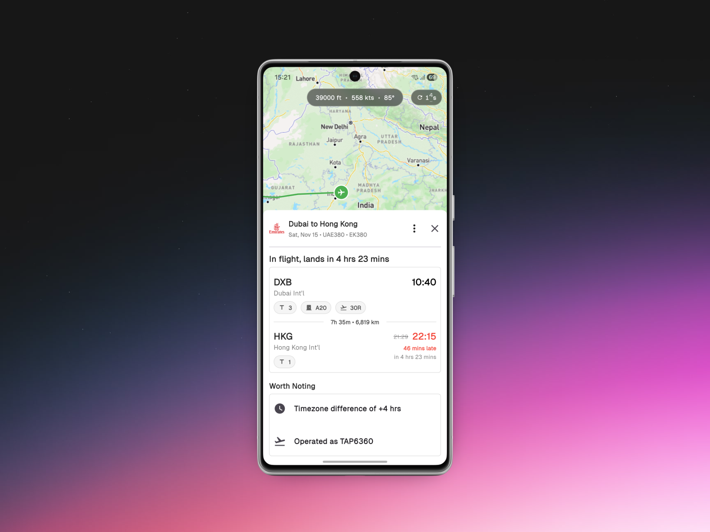
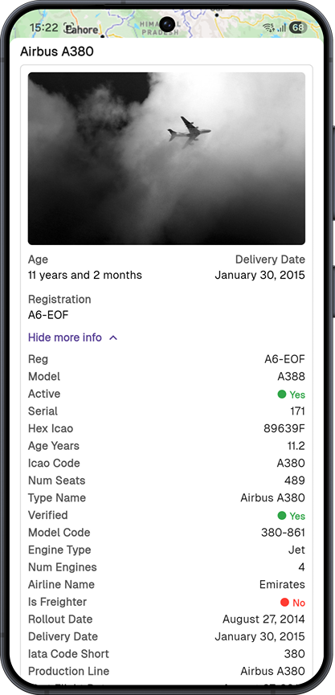
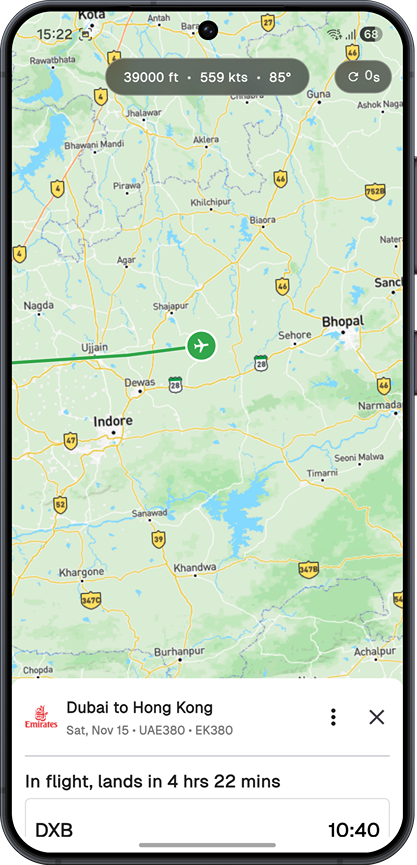
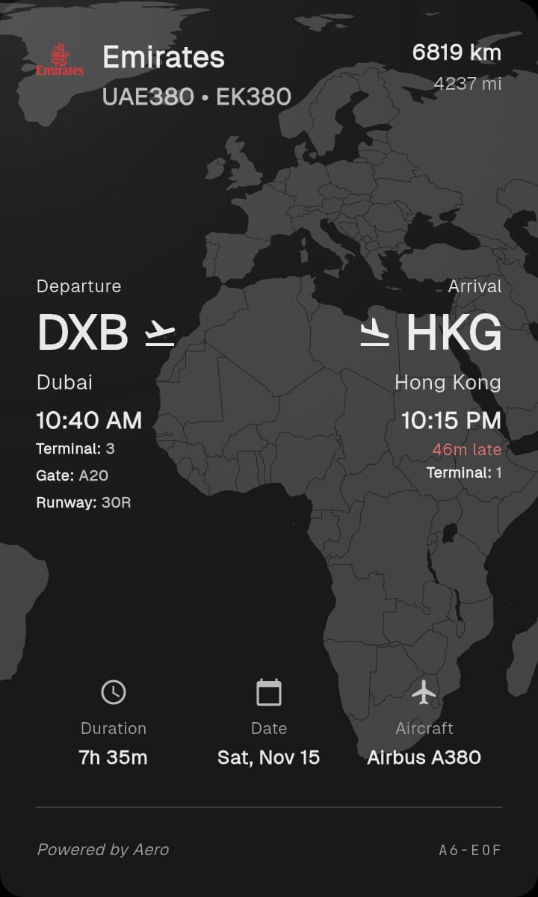

<div align="center">


# Aero

**Real-time flight tracking across all your devices**

[](https://flutter.dev)
[](https://nestjs.com)
[](https://www.typescriptlang.org)
[](https://react.dev)

_A comprehensive flight tracking platform with mobile apps and Wear OS companion_

</div>

---

## 🎯 What is Aero?

Aero is a full-stack flight tracking application that brings real-time flight information to your fingertips. Whether you're tracking your own flights, monitoring departures, or exploring aviation data, Aero provides a seamless experience across mobile, web, and wearable devices.

**Key Highlights:**

- 🛫 Real-time flight tracking with live updates
- 📊 Comprehensive flight statistics and analytics
- 📱 Native mobile apps with home screen widgets
- ⌚ Wear OS companion for quick flight info
- 🌐 Modern web interface
- 🔐 Secure user authentication and profiles

---

## Screenshots







## Shareable Cards


---


## 🏗️ Architecture

This monorepo is organized into distinct components, each serving a specific purpose in the Aero ecosystem.

### Backend Services

#### `api/` - Core REST API

The heart of Aero, built with NestJS and TypeScript.

```
┌─────────────────────────────────────────┐
│         NestJS REST API Server          │
├─────────────────────────────────────────┤
│ • JWT Authentication                    │
│ • Real-time Flight Tracking             │
│ • Flight Search & Booking Management    │
│ • Airport & Airline Data                │
│ • User Profiles & Statistics            │
│ • Redis Caching Layer                   │
│ • Prisma ORM + PostgreSQL               │
│ • OpenAPI/Swagger Documentation         │
└─────────────────────────────────────────┘
```

#### `backend/` - Legacy PocketBase

> ⚠️ **Note:** This was used for the initial draft and is no longer actively maintained.

---

### Client Applications

#### `app/` - Flutter Mobile App

Cross-platform mobile application for iOS and Android.

**Features:**

- Real-time flight tracking with live updates
- Interactive flight path visualization
- Home screen widgets for quick access
- Detailed flight statistics and analytics
- User authentication and profile management
- Dynamic app icon customization
- Offline data caching

#### `wearos/` - Wear OS Companion(under development)

Native Android Wear application for smartwatches.

#### `landing/` - Marketing Website

Modern, responsive landing page built with React and Vite.

**Tech:**

- React 19 with TypeScript
- Tailwind CSS for styling
- Vite for blazing-fast builds
- Responsive design for all devices

---

### Supporting Tools

| Tool       | Purpose                        | Tech                     |
| ---------- | ------------------------------ | ------------------------ |
| `scraper/` | Web scraping for airline data  | Playwright + Bun         |
| `scripts/` | Data management and migrations | TypeScript + Bun         |
| `openapi/` | Auto-generated API client      | Dart (from OpenAPI spec) |

---

## ✨ Features

### Flight Tracking

- **Real-time Updates** - Live flight position and status
- **Flight Search** - Find flights between any airports
- **Path Visualization** - See flight routes on interactive maps
- **Status Monitoring** - Track departures, arrivals, and delays
- **Historical Data** - Access past flight information

### Flight Management

- **Booking System** - Create and manage flight bookings
- **Multi-flight Tracking** - Monitor multiple flights simultaneously
- **Statistics Dashboard** - View comprehensive flight analytics
- **Personal Flight History** - Track your travel patterns

### Data & Information

- **Airport Database** - Comprehensive airport information
- **Airline Directory** - Detailed airline profiles
- **Aircraft Details** - Aircraft specifications and information
- **Route Information** - Flight route data and statistics

### User Experience

- **Authentication** - Secure user accounts with JWT
- **Personal Profiles** - Customizable user profiles
- **Flight Statistics** - Personal flight analytics
- **Custom App Icons** - Dynamic icon customization
- **Home Widgets** - Quick access from your home screen
- **Wear OS Integration** - Flight info on your wrist

---

## 🚀 Getting Started

### Prerequisites

Make sure you have the following installed:

- **Node.js** 20+ and **pnpm** 9.15.1+
- **Flutter SDK** 3.6.0+
- **PostgreSQL** database
- **Redis** server
- **Bun** (for scripts and scraper)
- **Android Studio** (for Wear OS development)

### Quick Start

#### 1. Backend API

```bash
cd api
pnpm install
cp .env.example .env  # Configure your environment variables
pnpm run prisma migrate dev
pnpm run start:dev
```

**API Endpoints:**

- API Server: `http://localhost:3000`
- API Docs: `http://localhost:3000/docs`
- Scalar API Reference: `http://localhost:3000/reference`

#### 2. Flutter Mobile App

```bash
cd app
flutter pub get
flutter run
```

#### 3. Landing Page

```bash
cd landing
bun install
bun run dev
```

#### 4. Scraper

```bash
cd scraper
bun install
bun run index.ts
```

#### 5. Scripts

```bash
cd scripts
bun install
bun run index.ts
```

## 💻 Development

### API Development

```bash
cd api
pnpm run start:dev    # Development with hot reload
pnpm run lint         # Lint code
pnpm run build        # Production build
```

### Flutter Development

```bash
cd app
flutter run                    # Run on device/emulator
flutter build apk              # Build Android APK, the native configuration isn't done for anything other than android
```

### OpenAPI Client Generation

Regenerate the Dart API client from the OpenAPI schema:

```bash
./generate-openapi-client.sh   # Generate client
```

---

Bonus for scrolling so far. Here is the image of my favourite livery.


Copyright: TommyNGB

Link: https://www.jetphotos.com/photo/11888246